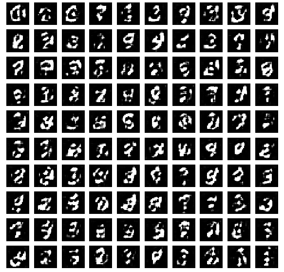
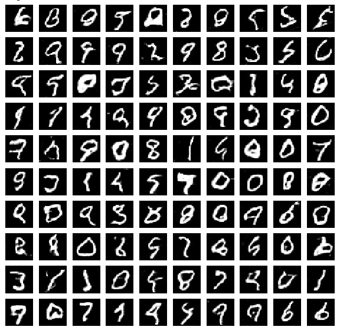

# DCGAN (Deep Convolutional Generative Adversarial Networks)

## Run the below code to visualize the output of the predicted model

```python
import numpy as np
import matplotlib.pyplot as plt

from keras.models import load_model

# model file path
mnist_2 = 'model weights/MNIST_2.h5'
mnist_30 = 'model weights/MNIST_30.h5'

# load model
model_2 = load_model(mnist_2)
model_30 = load_model(mnist_30)

# predict the output of both the model
noise = np.random.normal(0,1,(1,NOISE_DIM))
output_2 = model_2.predict(noise)
output_30 = model_30.predict(noise)

# visualize the output
plt.imshow(output_2.reshape((28,28)))
plt.imshow(output_30.reshape((28,28)))
```

  - To download the weights [CLICK HERE](https://drive.google.com/drive/folders/12yPSg2kCRL1Kc5rxOw32FxOcGHYDZJVu?usp=sharing)
## Get Data
   - You can download the MNIST data from [Kaggle](https://www.kaggle.com/c/digit-recognizer).
   - You can download the data from this [LINK](https://drive.google.com/drive/folders/1C7o2RL2MyPjpUo3Q1MiRo91p4GNZLOhs?usp=sharing).
   - You can use the keras and tensorflow to use the MNIST data.
        - Code:
        ```python
        from keras.datasets import mnist

        (X_train,y_train),(X_test,y_test) = mnist.load_data()
        ```

## CODE
  - Generator
    ```python
    gen = Sequential()
    gen.add( Dense(7*7*128, input_shape = (NOISE_DIM,)) )
    gen.add( Reshape((7,7,128)) )
    gen.add( LeakyReLU(0.2) )
    gen.add( BatchNormalization() )
    
    # Convert 7,7,128 => 14,14,64
    gen.add( UpSampling2D() )
    gen.add( Conv2D(64,kernel_size = (3,3),padding='same') )
    gen.add( LeakyReLU(0.2) )
    gen.add( BatchNormalization() )
    
    
    # Convert 14,14,64 => 28,28,1
    gen.add( UpSampling2D() )
    gen.add( Conv2D(1, kernel_size = (3,3), padding='same', activation = 'tanh') )
    ```
    
    The above code is for creating a generator for our DCGAN
    The code is upsampling(increase the spatial size) our data, here we are passing input as 100Dim Noise, and we are getting Output as (28,28) fake image of MNIST.
        
        Generator:
            Input: 
              Noise(100-d)
            Output : 
              Fake Images(28,28)
          
         Goal : 
            To minimize the probability of detection between fake and real data
       
  - Discriminator
  ```python
  dis = Sequential()
    dis.add( Conv2D(64, kernel_size = (3,3), strides = (2,2), padding = 'same', input_shape = (28,28,1)) )
    dis.add( LeakyReLU(0.2) )
    
    # 14,14,64 => 7,7,128
    dis.add( Conv2D(128, kernel_size = (3,3), padding = 'same', strides = (2,2)))
    dis.add( LeakyReLU(0.2) )

    dis.add( Flatten() )
    dis.add( Dense(1, activation='sigmoid') )
    
    dis.compile(loss= 'binary_crossentropy', optimizer=adam)
  ```
  The above code downsample the data.
      
      Discriminator:
      
          Input : 
            Real + Fake Images
          Output : 
            Prediction that Images are fake or real
        
      Goal:
        To maximize the probability of detection of real and fake data.
  - Train the GANs
      - There are 2 Steps to train a GAN. In the STEP-1 we will train our discriminator, and keep our generator as frozen. And STEP-2 we want that our discriminator should predict that our fake images are real images.
        So, we try to keep our Fake images as Real Images. If our model predict that image is fake, we will back propagate and gives the feedback to our generator and tells him to update his weights for better results.
        
   - Tips to Train GANs
      - Normalize the input in (-1,1) rather than (0,1)
      - Use ```activation = 'tanh'``` in the output layer of Generator.
      - Prefer LeakyRelu instead of ReLu.
      - Use ```optimizer = 'adam'```.
      
## Generator and Discriminator Loss
  - Generator loss should always be in increasing, whereas
  - Discriminator loss should be in decreasing order.
  
  Output Of Loss:
    
    
    This Image clearly tells that generator loss is increasing and discriminator loss is decreasing beacuse your 
    model successfully generates images that you discriminator fails to catch.
    
    
    
## Result of DCGAN
All the results are saved in fake_data
    
    
|  | 
|:--:| 
| *Result after 2 Epoch* |

In this Image we can't recognize what kind of Images we have made.


|  | 
|:--:| 
| *Result after 30 Epoch* |
      
In this Image, we can clearly see many images, but if train upto 40 epochs, we can much better results than this,
and in case if we try with 30 epochs, we need to change the parameters, I have tried with ```Adam(lr = 2e-4,beta_1 = 0.05)```, you can try your own parameters 
and compare your results.
      
      
      
      
      
      
      
      
      
      
      
      
      
      
      
      
      
      
